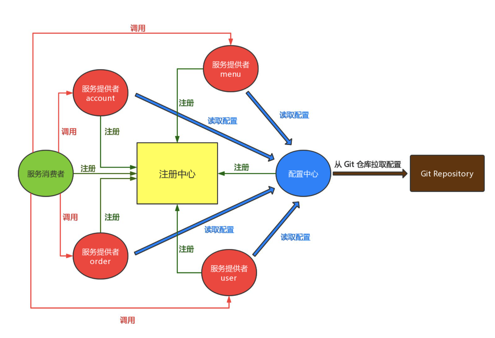
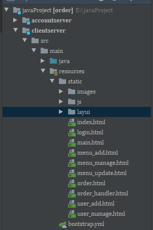

# 项目需求



* 客户端：针对普通用户、用户登录、退出，菜品订购、我的菜单。

* 后台管理系统：针对管理员的登录、退出，CRUD 菜品、订单、用户；

* account 提供账户服务：用户以及管理员的登录、退出；

* menu 提供菜品服务：CRUD菜品；

* order 提供订单服务：CRUD订单；

* user 提供用户服务：CRUD用户；

分离出一个消费者调用以上四个服务提供者，服务消费者包含了（客户端、后台管理系统）的前端页面和后台接口；用户和管理员访问的资源都存放在消费者服务中，服务消费者根据不同业务逻辑调用不同的服务提供者做相应的处理；通过feign实现负载均衡；

四个服务提供者以及服务消费者都需要在注册中心注册，同时可以使用配置中心对配置文件进行统一的管理；

## 父级模块

### 创建父工程，pom.xml

```xml
<modelVersion>4.0.0</modelVersion>

<groupId>org.example</groupId>
<artifactId>order</artifactId>
<packaging>pom</packaging>
<version>1.0-SNAPSHOT</version>
<modules>
    <module>eurekaserver</module>
</modules>

<parent>
    <groupId>org.springframework.boot</groupId>
    <artifactId>spring-boot-starter-parent</artifactId>
    <version>2.0.7.RELEASE</version>
</parent>

<dependencies>

    <dependency>
        <groupId>org.springframework.boot</groupId>
        <artifactId>spring-boot-starter-web</artifactId>
    </dependency>

</dependencies>

<dependencyManagement>
    <dependencies>
        <dependency>
            <groupId>org.springframework.cloud</groupId>
            <artifactId>spring-cloud-dependencies</artifactId>
            <version>Finchley.SR2</version>
            <type>pom</type>
            <scope>import</scope>
        </dependency>
    </dependencies>
</dependencyManagement>
```

## 注册中心

### pom.xml

```xml
<parent>
    <artifactId>takeout</artifactId>
    <groupId>com.wench.order</groupId>
    <version>0.0.1-SNAPSHOT</version>
</parent>
<modelVersion>4.0.0</modelVersion>

<artifactId>eurekaserver</artifactId>

<dependencies>
    <dependency>
        <groupId>org.springframework.cloud</groupId>
        <artifactId>spring-cloud-starter-netflix-eureka-server</artifactId>
        <version>2.0.1.RELEASE</version>
    </dependency>
</dependencies>
```

### application.yml

```yaml
server:
  port: 8761
eureka:
  client:
    service-url:
      defaultZone: http://localhost:8761/eureka/
    #是否将自己注入
    register-with-eureka: false
    #是否从其它地方导入
    fetch-registry: false
```

### 启动类 application

```java
package com.wench.eureka;

import org.springframework.boot.SpringApplication;
import org.springframework.boot.autoconfigure.SpringBootApplication;
import org.springframework.cloud.netflix.eureka.server.EnableEurekaServer;

/**
 * @Author: wench
 * @Description:
 * @Date: create in 2020/12/26 11:11
 */
@SpringBootApplication
@EnableEurekaServer
public class EurekaServerApplication {
    public static void main(String[] args) {
        SpringApplication.run(EurekaServerApplication.class, args);
    }
}
```

## 配置中心：

### pom.xml

```xml
<parent>
    <artifactId>order</artifactId>
    <groupId>org.example</groupId>
    <version>1.0-SNAPSHOT</version>
</parent>
<modelVersion>4.0.0</modelVersion>

<artifactId>configserver</artifactId>

<dependencies>
    <dependency>
        <groupId>org.springframework.cloud</groupId>
        <artifactId>spring-cloud-config-server</artifactId>
        <version>2.0.2.RELEASE</version>
    </dependency>
</dependencies>
```

### application.yml

```yaml
server:
  port: 8762
spring:
  application:
    name: configserver
  profiles:
    active: native
  cloud:
    config:
      server:
        native:
          search-locations: classpath:/shared
```

### shared

#### order-dev.yml

```yaml
server:
  port: 8010
spring:
  datasource:
    url: jdbc:mysql://localhost:3306/test?useUnicode=true&characterEncoding=UTF-8&serverTimezone=UTC&useSSL=false
    username: root
    password: root
    driver-class-name: com.mysql.cj.jdbc.Driver
eureka:
  client:
    service-url:
      defaultZone: http://localhost:8761/eureka/
  instance:
    prefer-ip-address: true
mybatis:
  mapper-locations: classpath:/mapping/*.xml
  type-aliases-package: com.wench.menu.entity
```

#### user-dev.yml

```yaml
server:
  port: 8020
spring:
  datasource:
    url: jdbc:mysql://localhost:3306/test?useUnicode=true&characterEncoding=UTF-8&serverTimezone=UTC&useSSL=false
    username: root
    password: root
    driver-class-name: com.mysql.cj.jdbc.Driver
eureka:
  client:
    service-url:
      defaultZone: http://localhost:8761/eureka/
  instance:
    prefer-ip-address: true
mybatis:
  mapper-locations: classpath:/mapping/*.xml
  type-aliases-package: com.wench.menu.entity
```

#### menu-dev.xml

```yaml
server:
  port: 8030
spring:
  datasource:
    url: jdbc:mysql://localhost:3306/test?useUnicode=true&characterEncoding=UTF-8&serverTimezone=UTC&useSSL=false
    username: root
    password: root
    driver-class-name: com.mysql.cj.jdbc.Driver
eureka:
  client:
    service-url:
      defaultZone: http://localhost:8761/eureka/
  instance:
    prefer-ip-address: true
mybatis:
  mapper-locations: classpath:/mapping/*.xml
  type-aliases-package: com.wench.menu.entity
```

#### account-dev.xml

```yaml
server:
  port: 8040
spring:
  datasource:
    url: jdbc:mysql://localhost:3306/test?useUnicode=true&characterEncoding=UTF-8&serverTimezone=UTC&useSSL=false
    username: root
    password: root
    driver-class-name: com.mysql.cj.jdbc.Driver
eureka:
  client:
    service-url:
      defaultZone: http://localhost:8761/eureka/
  instance:
    prefer-ip-address: true
mybatis:
  mapper-locations: classpath:/mapping/*.xml
  type-aliases-package: com.wench.menu.entity
```

#### client-dev.xml

```yaml
server:
  port: 8050
spring:
 application:
   name: client
 thymeleaf:
   prefix: classpath:/static/
   suffix: .html
eureka:
  client:
    service-url:
      defaultZone: http://localhost:8761/eureka/
  instance:
    prefer-ip-address: true
```

### 创建启动类

```java
package com.wench.config;

import org.springframework.boot.SpringApplication;
import org.springframework.boot.autoconfigure.SpringBootApplication;
import org.springframework.cloud.config.server.EnableConfigServer;

/**
 * @Author: wench
 * @Description:
 * @Date: create in 2020/12/26 12:49
 */
@SpringBootApplication
@EnableConfigServer
public class ConfigServerApplication {
    public static void main(String[] args) {
        SpringApplication.run(ConfigServerApplication.class,args);
    }
}
```

## 服务提供者 orderserver

### pom.xml

```xml
<parent>
    <artifactId>order</artifactId>
    <groupId>org.example</groupId>
    <version>1.0-SNAPSHOT</version>
</parent>
<modelVersion>4.0.0</modelVersion>

<artifactId>orderserver</artifactId>

<dependencies>

    <dependency>
        <groupId>org.springframework.cloud</groupId>
        <artifactId>spring-cloud-starter-netflix-eureka-client</artifactId>
        <version>2.0.2.RELEASE</version>
    </dependency>

    <dependency>
        <groupId>org.springframework.cloud</groupId>
        <artifactId>spring-cloud-starter-config</artifactId>
        <version>2.0.2.RELEASE</version>
    </dependency>

    <dependency>
        <groupId>org.mybatis.spring.boot</groupId>
        <artifactId>mybatis-spring-boot-starter</artifactId>
        <version>1.3.1</version>
    </dependency>

    <dependency>
        <groupId>mysql</groupId>
        <artifactId>mysql-connector-java</artifactId>
        <version>8.0.18</version>
    </dependency>
</dependencies>
```

### bootstrap.yml

```yaml

spring:
  application:
    name: order
  profiles:
    active: dev
  cloud:
    config:
      #此处为 uri 不是 url
      uri: http://localhost:8762
      fail-fast: true
```

### 启动类

```java
package com.wench.order;

import org.mybatis.spring.annotation.MapperScan;
import org.springframework.boot.SpringApplication;
import org.springframework.boot.autoconfigure.SpringBootApplication;

/**
 * @Author: wench
 * @Description:
 * @Date: create in 2020/12/26 13:00
 */
@SpringBootApplication
@MapperScan("com.wench.order.repository")
public class OrderServerApplication {
    public static void main(String[] args) {
        SpringApplication.run(OrderServerApplication.class,args);
    }
}
```

### 订单controller

```java
package com.wench.order.controller;

import com.wench.order.entity.Order;
import com.wench.order.entity.OrderVO;
import com.wench.order.repository.OrderRepository;
import org.springframework.beans.factory.annotation.Autowired;
import org.springframework.beans.factory.annotation.Value;
import org.springframework.web.bind.annotation.*;

/**
 * @Author: wench
 * @Description:
 * @Date: create in 2020/12/26 13:00
 */
@RestController
@RequestMapping("/order")
public class OrderController {

    @Value("${server.port}")
    private String port;

    @GetMapping("/index")
    public String index(){
        return "订单服务端口号："+ this.port;
    }

    @Autowired
    private OrderRepository orderRepository;

    /**
     * 订单添加
     * @param order
     */
    @PostMapping("/save")
    public void save(@RequestBody Order order){
        orderRepository.save(order);
    }

    /**
     * 通过用户id查询
     * @param uid
     * @param page
     * @param limit
     * @return
     */
    @GetMapping("/findAllByUid/{uid}/{page}/{limit}")
    public OrderVO findAllByUid(@PathVariable("uid") long uid, @PathVariable("page") int page, @PathVariable("limit") int limit){
        OrderVO orderVO = new OrderVO();
        orderVO.setCode(0);
        orderVO.setMsg("");
        orderVO.setCount(orderRepository.countByUid(uid));
        orderVO.setData(orderRepository.findAllByUid(uid,(page-1)*limit,limit));
        return orderVO;
    }

    /**
     * 删除
     * @param mid
     */
    @DeleteMapping("/deleteByMid/{mid}")
    public void deleteByMid(@PathVariable("mid") long mid){
        orderRepository.deleteByMid(mid);
    }

    /**
     * 通过用户id删除
     * @param uid
     */
    @DeleteMapping("/deleteByUid/{uid}")
    public void deleteByUid(@PathVariable("uid") long uid){
        orderRepository.deleteByUid(uid);
    }

    /**
     * 通过状态查询
     * @param state
     * @param page
     * @param limit
     * @return
     */
    @GetMapping("/findAllByState/{state}/{page}/{limit}")
    public OrderVO findAllByState(@PathVariable("state") int state, @PathVariable("page") int page, @PathVariable("limit") int limit){
        OrderVO orderVO = new OrderVO();
        orderVO.setCode(0);
        orderVO.setMsg("");
        orderVO.setCount(orderRepository.countByState(0));
        orderVO.setData(orderRepository.findAllByState(0,(page-1)*limit,limit));
        return orderVO;
    }

    /**
     * 修改订单
     * @param id
     * @param state
     * @param aid
     */
    @PutMapping("/updateState/{id}/{state}/{aid}")
    public void updateState(@PathVariable("id") long id, @PathVariable("state") int state, @PathVariable("aid") long aid){
        orderRepository.updateState(id,aid,state);
    }
}
```

### entity

#### Account

```java
package com.wench.order.entity;

import lombok.Data;

import java.util.Date;

@Data
public class Account {
    private long id;
    private String username;
    private String password;
    private String nickname;
    private String gender;
    private String telephone;
    private Date registerdate;
    private String address;
}
```

#### Admin

```java
package com.wench.order.entity;

import lombok.Data;

@Data
public class Admin extends Account {

}
```

#### Menu

```java
package com.wench.order.entity;

import lombok.Data;

@Data
public class Menu {
    private long id;
    private String name;
    private double price;
    private String flavor;
    private Type type;
}
```

#### Order

```java
package com.wench.order.entity;

import lombok.Data;

import java.util.Date;

@Data
public class Order {
    private long id;
    private User user;
    private Menu menu;
    private Admin admin;
    private Date date;
    private int state;
}
```

#### OrderVO

```java
package com.wench.order.entity;

import lombok.Data;

import java.util.List;

@Data
public class OrderVO {
    private int code;
    private String msg;
    private int count;
    private List<Order> data;
}
```

#### Type

```java
package com.wench.order.entity;

import lombok.Data;

@Data
public class Type {
    private long id;
    private String name;
}
```

#### User

```java
package com.wench.order.entity;

import lombok.Data;

@Data
public class User extends Account {

}
```

### repository

#### OrderRepository

```java
package com.wench.order.repository;


import com.wench.order.entity.Order;

import java.util.List;

public interface OrderRepository {

    public void save(Order order);

    public List<Order> findAllByUid(long uid, int index, int limit);

    public int countByUid(long uid);

    public void deleteByMid(long mid);

    public void deleteByUid(long uid);

    public List<Order> findAllByState(int state,int index,int limit);

    public int countByState(int state);

    public void updateState(long id,long aid,int state);
}
```

### mapping

#### OrderRepository.xml

```xml
<?xml version="1.0" encoding="UTF-8" ?>
<!DOCTYPE mapper PUBLIC "-//mybatis.org//DTD Mapper 3.0//EN" "http://mybatis.org/dtd/mybatis-3-mapper.dtd">
<mapper namespace="com.wench.order.repository.OrderRepository">

    <resultMap id="orderMap" type="com.wench.order.entity.Order">
        <id property="id" column="oid"/>
        <result property="date" column="date"/>
        <result property="state" column="state"/>
        <!-- 映射menu -->
        <association property="menu" javaType="com.wench.order.entity.Menu">
            <id property="id" column="mid"/>
            <result property="name" column="name"/>
            <result property="price" column="price"/>
            <result property="flavor" column="flavor"/>
        </association>
    </resultMap>

    <resultMap id="orderMap2" type="com.wench.order.entity.Order">
        <id property="id" column="oid"/>
        <result property="date" column="date"/>
        <!-- 映射menu -->
        <association property="menu" javaType="com.wench.order.entity.Menu">
            <id property="id" column="mid"/>
            <result property="name" column="name"/>
            <result property="price" column="price"/>
            <result property="flavor" column="flavor"/>
        </association>
        <!-- 映射user -->
        <association property="user" javaType="com.wench.order.entity.User">
            <id property="id" column="uid"/>
            <result property="nickname" column="nickname"/>
            <result property="telephone" column="telephone"/>
            <result property="address" column="address"/>
        </association>
    </resultMap>
    <insert id="save" parameterType="com.wench.order.entity.Order">
        insert into t_order(uid,mid,aid,date,state) values(#{user.id},#{menu.id},#{admin.id},#{date},0)
    </insert>

    <select id="findAllByUid" resultMap="orderMap">
        select m.id mid,m.name,m.price,m.flavor,o.id oid,o.date,o.state from t_order o,t_menu m where o.mid = m.id and o.uid = #{param1} order by oid limit #{param2},#{param3}
    </select>

    <select id="countByUid" parameterType="long" resultType="int">
        select count(*) from t_order where uid = #{uid}
    </select>

    <delete id="deleteByMid" parameterType="long">
        delete from t_order where mid = #{mid}
    </delete>

    <delete id="deleteByUid" parameterType="long">
        delete from t_order where uid = #{uid}
    </delete>

    <select id="findAllByState" resultMap="orderMap2">
        select m.id mid,m.name,m.price,m.flavor,o.id oid,o.date,o.state,u.id uid,u.nickname,u.telephone,u.address from t_order o,t_menu m,t_user u where o.mid = m.id and o.uid = u.id and o.state = #{param1} order by oid limit #{param2},#{param3}
    </select>

    <select id="countByState" parameterType="int" resultType="int">
        select count(*) from t_order where state = #{state}
    </select>

    <update id="updateState">
        update t_order set aid = #{param2},state = #{param3} where id = #{param1}
    </update>

</mapper>
```

## menu 服务实现

### pom.xml

```xml
<parent>
    <artifactId>order</artifactId>
    <groupId>org.example</groupId>
    <version>1.0-SNAPSHOT</version>
</parent>
<modelVersion>4.0.0</modelVersion>

<artifactId>menuserver</artifactId>

<dependencies>

    <dependency>
        <groupId>org.springframework.cloud</groupId>
        <artifactId>spring-cloud-starter-netflix-eureka-client</artifactId>
        <version>2.0.2.RELEASE</version>
    </dependency>

    <dependency>
        <groupId>org.springframework.cloud</groupId>
        <artifactId>spring-cloud-starter-config</artifactId>
        <version>2.0.2.RELEASE</version>
    </dependency>

    <dependency>
        <groupId>org.mybatis.spring.boot</groupId>
        <artifactId>mybatis-spring-boot-starter</artifactId>
        <version>1.3.1</version>
    </dependency>

    <dependency>
        <groupId>mysql</groupId>
        <artifactId>mysql-connector-java</artifactId>
        <version>8.0.18</version>
    </dependency>
</dependencies>
```

### bootstrap.yml

```yaml
spring:
  application:
    name: menu
  profiles:
    active: dev
  cloud:
    config:
      #此处为 uri 不是 url
      uri: http://localhost:8762
      fail-fast: true
```

### 启动类

```java
package com.wench.menu;

import org.mybatis.spring.annotation.MapperScan;
import org.springframework.boot.SpringApplication;
import org.springframework.boot.autoconfigure.SpringBootApplication;

/**
 * @Author: wench
 * @Description:
 * @Date: create in 2020/12/26 13:23
 */
@SpringBootApplication
@MapperScan("com.wench.menu.repository")
public class MenuServerApplication {
    public static void main(String[] args) {
        SpringApplication.run(MenuServerApplication.class, args);
    }
}
```

### controller

```java
package com.wench.menu.controller;

import com.wench.menu.entity.Menu;
import com.wench.menu.entity.Type;
import com.wench.menu.repository.MenuRepositroy;
import com.wench.menu.repository.TypeRepositroy;
import org.springframework.beans.factory.annotation.Autowired;
import org.springframework.beans.factory.annotation.Value;
import org.springframework.web.bind.annotation.*;

import java.util.List;

/**
 * @Author: wench
 * @Description:
 * @Date: create in 2020/12/26 13:24
 */
@RestController
@RequestMapping("/menu")
public class MenuController {

    @Value("${server.port}")
    private String port;

    @Autowired
    MenuRepositroy menuRepositroy;

    @Autowired
    TypeRepositroy typeRepositroy;

    @GetMapping("/index")
    public String index() {
        return "菜品端口号为：" + this.port;
    }

    @GetMapping("/findAll/{index}/{limit}")
    public List<Menu> findAll(@PathVariable("index") int index, @PathVariable("limit") int limit) {
        index = (index - 1) * limit;
        return menuRepositroy.findAll(index, limit);
    }

    @GetMapping("/findTypes")
    public List<Type> findTypes() {
        return typeRepositroy.findAll();
    }

    @DeleteMapping("/deleteById/{id}")
    public void deleteById(@PathVariable("id") long id) {
        menuRepositroy.deleteById(id);
    }

    @PostMapping("/save")
    void save(@RequestBody Menu menu) {
        menuRepositroy.save(menu);
    }

    @GetMapping("/findById/{id}")
    Menu findById(@PathVariable("id") long id) {
        return menuRepositroy.findById(id);
    }

    @PostMapping("/update")
    void update(@RequestBody Menu menu) {
        menuRepositroy.update(menu);
    }
}
```

### entity

#### Menu

```java
package com.wench.menu.entity;

import lombok.Data;

/**
 * @Author: wench
 * @Description:
 * @Date: create in 2020/12/27 10:45
 */
@Data
public class Menu {
    private long id;
    private String name;
    private double price;
    private String flavor;
    private Type type;
    private String author;
}
```

#### MenuVO

```java
package com.wench.menu.entity;

import lombok.Data;

import java.util.List;

/**
 * @Author: wench
 * @Description:
 * @Date: create in 2020/12/27 10:47
 */
@Data
public class MenuVO {
    private int code;
    private String msg;
    private int count;
    private List<Menu> data;
}
```

#### Type

```java
package com.wench.menu.entity;

import lombok.Data;

/**
 * @Author: wench
 * @Description:
 * @Date: create in 2020/12/27 10:46
 */
@Data
public class Type {
    private long id;
    private String name;
}
```

### repository

#### MenuRepositroy

```java
package com.wench.menu.repository;

import com.wench.menu.entity.Menu;

import java.util.List;

public interface MenuRepositroy {

    List<Menu> findAll(int index, int limit);

    int count();

    Menu findById(long id);

    void save(Menu menu);

    void update(Menu menu);

    void deleteById(long id);
}
```

#### TypeRepositroy

```java
package com.wench.menu.repository;

import com.wench.menu.entity.Menu;
import com.wench.menu.entity.Type;

import java.util.List;

public interface TypeRepositroy {

    List<Type> findAll();

}
```

### mapping

#### MenuRepository.xml

```xml
<?xml version="1.0" encoding="UTF-8" ?>
<!DOCTYPE mapper PUBLIC "-//mybatis.org//DTD Mapper 3.0//EN" "http://mybatis.org/dtd/mybatis-3-mapper.dtd">
<mapper namespace="com.wench.menu.repository.MenuRepositroy">

    <resultMap id="menuMap" type="com.wench.menu.entity.Menu">
        <id property="id" column="mid"/>
        <result property="name" column="mname"/>
        <result property="author" column="author"/>
        <result property="price" column="price"/>
        <result property="flavor" column="flavor"/>
        <!-- 映射type -->
        <association property="type" javaType="com.wench.menu.entity.Type">
            <id property="id" column="tid"/>
            <result property="name" column="tname"/>
        </association>
    </resultMap>

    <select id="findAll" resultMap="menuMap">
      select m.id mid,m.name mname,m.price,m.flavor,t.id tid,t.name tname from t_menu m,t_type t where m.tid = t.id order by mid limit #{param1},#{param2}
   </select>

    <select id="count" resultType="int">
      select count(*) from t_menu;
   </select>

    <insert id="save" parameterType="com.wench.menu.entity.Menu">
      insert into t_menu(name,price,flavor,tid) values(#{name},#{price},#{flavor},#{type.id})
   </insert>

    <select id="findById" resultMap="menuMap">
      select id mid,name mname,price,flavor,tid from t_menu where id = #{id}
   </select>

    <update id="update" parameterType="com.wench.menu.entity.Menu">
      update t_menu set name = #{name},price = #{price},flavor = #{flavor},tid = #{type.id} where id = #{id}
   </update>

    <delete id="deleteById" parameterType="long">
      delete from t_menu where id = #{id}
   </delete>
</mapper>
```

#### TypeRepository.xml

```xml
<?xml version="1.0" encoding="UTF-8" ?>
<!DOCTYPE mapper PUBLIC "-//mybatis.org//DTD Mapper 3.0//EN" "http://mybatis.org/dtd/mybatis-3-mapper.dtd">
<mapper namespace="com.wench.menu.repository.TypeRepositroy">

    <resultMap id="menuMap" type="com.wench.menu.entity.Type">
        <id property="id" column="id"/>
        <result property="name" column="name"/>
    </resultMap>

    <select id="findAll" resultMap="menuMap">
      select * from t_type t
   </select>

</mapper>
```

## 创建服务消费者 client：

### pom.xml

```xml
<parent>
    <artifactId>order</artifactId>
    <groupId>org.example</groupId>
    <version>1.0-SNAPSHOT</version>
</parent>
<modelVersion>4.0.0</modelVersion>

<artifactId>clientserver</artifactId>

<dependencies>

    <dependency>
        <groupId>org.springframework.cloud</groupId>
        <artifactId>spring-cloud-starter-netflix-eureka-client</artifactId>
        <version>2.0.2.RELEASE</version>
    </dependency>

    <dependency>
        <groupId>org.springframework.cloud</groupId>
        <artifactId>spring-cloud-starter-openfeign</artifactId>
        <version>2.0.1.RELEASE</version>
    </dependency>

    <dependency>
        <groupId>org.springframework.boot</groupId>
        <artifactId>spring-boot-starter-thymeleaf</artifactId>
    </dependency>

    <dependency>
        <groupId>org.springframework.cloud</groupId>
        <artifactId>spring-cloud-starter-config</artifactId>
        <version>2.0.2.RELEASE</version>
    </dependency>
</dependencies>
```

### bootstrap.yml

```yaml
spring:
  application:
    name: client
  profiles:
    active: dev
  cloud:
    config:
      #此处为 uri 不是 url
      uri: http://localhost:8762
      fail-fast: true
```

### 启动类

```java
package com.wench.client;

import org.springframework.boot.SpringApplication;
import org.springframework.boot.autoconfigure.SpringBootApplication;
import org.springframework.boot.web.servlet.ServletComponentScan;
import org.springframework.cloud.openfeign.EnableFeignClients;

/**
 * @Author: wench
 * @Description:
 * @Date: create in 2020/12/27 11:52
 */
@SpringBootApplication
@EnableFeignClients
@ServletComponentScan
public class ClientserverApplication {
    public static void main(String[] args) {
        SpringApplication.run(ClientserverApplication.class, args);
    }
}
```

### controller

#### AccountController

```java
package com.wench.client.controller;


import com.wench.client.entity.Account;
import com.wench.client.entity.Admin;
import com.wench.client.entity.User;
import com.wench.client.feign.AccountFeign;
import com.wench.client.utils.ReflectUtils;
import org.springframework.beans.factory.annotation.Autowired;
import org.springframework.stereotype.Controller;
import org.springframework.web.bind.annotation.*;

import javax.servlet.http.HttpSession;
import java.util.Date;

@Controller
@RequestMapping("/account")
public class AccountController {

    @Autowired
    private AccountFeign accountFeign;

    /**
     * 用户登录接口
     * @param username
     * @param password
     * @param type
     * @param session
     * @return
     */
    @PostMapping("/login")
    public String login(@RequestParam("username") String username, @RequestParam("password") String password, @RequestParam("type") String type, HttpSession session) {
        Account account = accountFeign.login(username, password, type);
        String target = null;
        if (account == null) {
            target = "redirect:/view/redirect/login";
        } else {
            switch (type) {
                case "user":
                    User user = convertUser(account);
                    session.setAttribute("user", user);
                    target = "redirect:/view/redirect/index";
                    break;
                case "admin":
                    Admin admin = convertAdmin(account);
                    session.setAttribute("admin", admin);
                    target = "redirect:/view/redirect/main";
                    break;
            }
        }
        return target;
    }

    /**
     * 用户登出
     * @param session
     * @return
     */
    @GetMapping("/logout")
    public String logout(HttpSession session) {
        session.invalidate();
        return "login";
    }

    private User convertUser(Account account) {
        User user = new User();
        user.setUsername(ReflectUtils.getFieldValue(account, "username") + "");
        user.setPassword(ReflectUtils.getFieldValue(account, "password") + "");
        user.setGender(ReflectUtils.getFieldValue(account, "gender") + "");
        user.setId((long) (ReflectUtils.getFieldValue(account, "id")));
        user.setNickname(ReflectUtils.getFieldValue(account, "nickname") + "");
        user.setRegisterdate((Date) (ReflectUtils.getFieldValue(account, "registerdate")));
        user.setTelephone(ReflectUtils.getFieldValue(account, "telephone") + "");
        return user;
    }

    private Admin convertAdmin(Account account) {
        Admin admin = new Admin();
        admin.setUsername(ReflectUtils.getFieldValue(account, "username") + "");
        admin.setPassword(ReflectUtils.getFieldValue(account, "password") + "");
        admin.setId((long) (ReflectUtils.getFieldValue(account, "id")));
        return admin;
    }
}
```

#### MenuClientController

```java
package com.wench.client.controller;

import com.wench.client.entity.Menu;
import com.wench.client.entity.MenuVO;
import com.wench.client.feign.MenuFeign;
import org.springframework.beans.factory.annotation.Autowired;
import org.springframework.stereotype.Controller;
import org.springframework.web.bind.annotation.*;
import org.springframework.web.servlet.ModelAndView;

/**
 * @Author: wench
 * @Description:
 * @Date: create in 2020/12/27 12:06
 */
@Controller
@RequestMapping("/menu")
public class MenuClientController {

    @Autowired
    MenuFeign menuFeign;

    /**
     * 分页查询列表
     * @param page
     * @param limit
     * @return
     */
    @GetMapping("/findAll")
    @ResponseBody
    public MenuVO findAll(@RequestParam("page") int page, @RequestParam("limit") int limit){
        return new MenuVO(0,"",1000, menuFeign.findAll(page, limit));
    }

    /**
     * 删除
     * @param id
     * @return
     */
    @GetMapping("/deleteById/{id}")
    public String deleteById(@PathVariable("id") long id){
        menuFeign.deleteById(id);
        return "menu_manage";
    }

    /**
     * 查询所有分类
     * @return
     */
    @GetMapping("/findTypes")
    public ModelAndView findTypes(){
        ModelAndView modelAndView = new ModelAndView();
        modelAndView.addObject("list", menuFeign.findTypes());
        modelAndView.setViewName("menu_add");
        return modelAndView;
    }

    /**
     * 添加
     * @param menu
     * @return
     */
    @PostMapping("/save")
    public String save(Menu menu){
        menuFeign.save(menu);
        return "menu_manage";
    }

    /**
     * 查询详情
     * @param id
     * @return
     */
    @GetMapping("/findById/{id}")
    public ModelAndView findById(@PathVariable("id") long id){
        ModelAndView modelAndView = new ModelAndView();
        modelAndView.addObject("menu", menuFeign.findById(id));
        modelAndView.addObject("list", menuFeign.findTypes());
        modelAndView.setViewName("menu_update");
        return modelAndView;
    }

    /**
     * 修改
     * @param menu
     * @return
     */
    @PostMapping("/update")
    public String update(Menu menu){
        menuFeign.update(menu);
        return "menu_manage";
    }
}
```

#### OrderController

```java
package com.wench.client.controller;


import com.wench.client.entity.*;
import com.wench.client.feign.OrderFeign;
import org.springframework.beans.factory.annotation.Autowired;
import org.springframework.stereotype.Controller;
import org.springframework.web.bind.annotation.*;

import javax.servlet.http.HttpSession;
import java.util.Date;

@Controller
@RequestMapping("/order")
public class OrderController {

    @Autowired
    private OrderFeign orderFeign;

    /**
     * 订单保存接口
     * @param mid
     * @param session
     * @return
     */
    @GetMapping("/save/{mid}")
    public String save(@PathVariable("mid") long mid, HttpSession session){
        User user = (User) session.getAttribute("user");
        Order order = new Order();
        Menu menu = new Menu();
        menu.setId(mid);
        order.setUser(user);
        order.setMenu(menu);
        order.setDate(new Date());
        orderFeign.save(order);
        return "redirect:/account/redirect/order";
    }

    /**
     * 通过用户查询
     * @param page
     * @param limit
     * @param session
     * @return
     */
    @GetMapping("/findAllByUid")
    @ResponseBody
    public OrderVO findAllByUid(@RequestParam("page") int page, @RequestParam("limit") int limit, HttpSession session){
        User user = (User) session.getAttribute("user");
        return orderFeign.findAllByUid(user.getId(), page, limit);
    }

    /**
     * 通过订单查询
     * @param page
     * @param limit
     * @return
     */
    @GetMapping("/findAllByState")
    @ResponseBody
    public OrderVO findAllByState(@RequestParam("page") int page, @RequestParam("limit") int limit){
        return orderFeign.findAllByState(0, page, limit);
    }

    /**
     * 更新
     * @param id
     * @param state
     * @param session
     * @return
     */
    @GetMapping("/updateState/{id}/{state}")
    public String updateState(@PathVariable("id") long id,@PathVariable("state") int state,HttpSession session){
        Admin admin = (Admin) session.getAttribute("admin");
        orderFeign.updateState(id,state,admin.getId());
        return "redirect:/account/redirect/order_handler";
    }
}
```

#### UserClientController

```java
package com.wench.client.controller;

import com.wench.client.entity.Menu;
import com.wench.client.entity.MenuVO;
import com.wench.client.entity.User;
import com.wench.client.entity.UserVO;
import com.wench.client.feign.MenuFeign;
import com.wench.client.feign.UserFeign;
import org.springframework.beans.factory.annotation.Autowired;
import org.springframework.stereotype.Controller;
import org.springframework.web.bind.annotation.*;
import org.springframework.web.servlet.ModelAndView;

/**
 * @Author: wench
 * @Description:
 * @Date: create in 2020/12/27 12:06
 */
@Controller
@RequestMapping("/user")
public class UserClientController {

    @Autowired
    UserFeign userFeign;

    /**
     * 分页查询列表
     * @param page
     * @param limit
     * @return
     */
    @GetMapping("/findAll")
    @ResponseBody
    public UserVO findAll(@RequestParam("page") int page, @RequestParam("limit") int limit){
        return new UserVO(0,"",1000, userFeign.findAll(page, limit));
    }

    /**
     * 删除
     * @param id
     * @return
     */
    @GetMapping("/deleteById/{id}")
    public String deleteById(@PathVariable("id") long id){
        userFeign.deleteById(id);
        return "user_manage";
    }

    /**
     * 添加
     * @param user
     * @return
     */
    @PostMapping("/save")
    public String save(User user){
        userFeign.save(user);
        return "user_manage";
    }

    /**
     * 查询详情
     * @param id
     * @return
     */
    @GetMapping("/findById/{id}")
    public ModelAndView findById(@PathVariable("id") long id){
        ModelAndView modelAndView = new ModelAndView();
        modelAndView.addObject("user", userFeign.findById(id));
        modelAndView.setViewName("user_update");
        return modelAndView;
    }

    /**
     * 修改
     * @param user
     * @return
     */
    @PostMapping("/update")
    public String update(User user){
        userFeign.update(user);
        return "user_manage";
    }
}
```

#### ViewClientController

```java
package com.wench.client.controller;

import com.wench.client.entity.Menu;
import com.wench.client.entity.MenuVO;
import com.wench.client.feign.MenuFeign;
import org.springframework.beans.factory.annotation.Autowired;
import org.springframework.stereotype.Controller;
import org.springframework.web.bind.annotation.*;
import org.springframework.web.servlet.ModelAndView;

/**
 * @Author: wench
 * @Description:
 * @Date: create in 2020/12/27 12:06
 */
@Controller
@RequestMapping("/view")
public class ViewClientController {

    @Autowired
    MenuFeign menuFeign;

    /**
     * 重定向到某页面
     * @param index
     * @return
     */
    @GetMapping("/redirect/{index}")
    public String findAll(@PathVariable("index") String index){
        return index;
    }
}
```

### entity

#### Account

```java
package com.wench.client.entity;

import lombok.Data;

import java.util.Date;

@Data
public class Account {
    private long id;
    private String username;
    private String password;
    private String nickname;
    private String gender;
    private String telephone;
    private Date registerdate;
    private String address;
}
```

#### Admin

```java
package com.wench.client.entity;

import lombok.Data;

@Data
public class Admin extends Account {

}
```

#### Menu

```java
package com.wench.client.entity;

import lombok.Data;

/**
 * @Author: wench
 * @Description:
 * @Date: create in 2020/12/27 10:45
 */
@Data
public class Menu {
    private long id;
    private String name;
    private double price;
    private String flavor;
    private Type type;
    private String author;
}
```

#### MenuVO

```java
package com.wench.client.entity;

import lombok.AllArgsConstructor;
import lombok.Data;
import lombok.NoArgsConstructor;

import java.util.List;

/**
 * @Author: wench
 * @Description:
 * @Date: create in 2020/12/27 10:47
 */
@Data
@AllArgsConstructor
@NoArgsConstructor
public class MenuVO {
    private int code;
    private String msg;
    private int count;
    private List<Menu> data;
}
```

#### Order

```java
package com.wench.client.entity;

import lombok.Data;

import java.util.Date;

@Data
public class Order {
    private long id;
    private User user;
    private Menu menu;
    private Admin admin;
    private Date date;
    private int state;
}
```

#### OrderVO

```java
package com.wench.client.entity;

import lombok.Data;

import java.util.List;

@Data
public class OrderVO {
    private int code;
    private String msg;
    private int count;
    private List<Order> data;
}
```

#### Type

```java
package com.wench.client.entity;

import lombok.Data;

/**
 * @Author: wench
 * @Description:
 * @Date: create in 2020/12/27 10:46
 */
@Data
public class Type {
    private long id;
    private String name;
}
```

#### User

```java
package com.wench.client.entity;

import lombok.Data;

import java.util.Date;

@Data
public class User extends Account{
}
```

#### UserVO

```java
package com.wench.client.entity;

import lombok.AllArgsConstructor;
import lombok.Data;
import lombok.NoArgsConstructor;

import java.util.List;

@Data
@AllArgsConstructor
@NoArgsConstructor
public class UserVO {
    private int code;
    private String msg;
    private int count;
    private List<User> data;
}
```

### feign

#### AccountFeign

```java
package com.wench.client.feign;


import com.wench.client.entity.Account;
import org.springframework.cloud.openfeign.FeignClient;
import org.springframework.web.bind.annotation.GetMapping;
import org.springframework.web.bind.annotation.PathVariable;

@FeignClient(value = "account")
public interface AccountFeign {

    @GetMapping("/account/login/{username}/{password}/{type}")
    public Account login(@PathVariable("username") String username, @PathVariable("password") String password, @PathVariable("type") String type);
}
```

#### MenuFeign

```java
package com.wench.client.feign;

import com.wench.client.entity.Menu;
import com.wench.client.entity.Type;
import org.springframework.cloud.openfeign.FeignClient;
import org.springframework.web.bind.annotation.*;

import java.util.List;

@FeignClient("menu")
public interface MenuFeign {

    @GetMapping("/menu/findAll/{index}/{limit}")
    public List<Menu> findAll(@PathVariable("index") int index, @PathVariable("limit") int limit);

    @DeleteMapping("/menu/deleteById/{id}")
    void deleteById(@PathVariable("id") long id);

    @GetMapping("/menu/findTypes")
    List<Type> findTypes();

    @PostMapping("/menu/save")
    void save(@RequestBody Menu menu);

    @GetMapping("/menu/findById/{id}")
    Menu findById(@PathVariable("id") long id);

    @PostMapping("/menu/update")
    void update(Menu menu);
}
```

#### OrderFeign

```java
package com.wench.client.feign;


import com.wench.client.entity.Order;
import com.wench.client.entity.OrderVO;
import org.springframework.cloud.openfeign.FeignClient;
import org.springframework.web.bind.annotation.*;

@FeignClient(value = "order")
public interface OrderFeign {

    @PostMapping("/order/save")
    public void save(@RequestBody Order order);

    @GetMapping("/order/findAllByUid/{uid}/{page}/{limit}")
    public OrderVO findAllByUid(@PathVariable("uid") long uid, @PathVariable("page") int page, @PathVariable("limit") int limit);

    @DeleteMapping("/order/deleteByMid/{mid}")
    public void deleteByMid(@PathVariable("mid") long mid);

    @DeleteMapping("/order/deleteByUid/{uid}")
    public void deleteByUid(@PathVariable("uid") long uid);

    @GetMapping("/order/findAllByState/{state}/{page}/{limit}")
    public OrderVO findAllByState(@PathVariable("state") int state, @PathVariable("page") int page, @PathVariable("limit") int limit);

    @PutMapping("/order/updateState/{id}/{state}/{aid}")
    public void updateState(@PathVariable("id") long id, @PathVariable("state") long state,@PathVariable("aid") long aid);
}
```

#### UserFeign

```java
package com.wench.client.feign;

import com.wench.client.entity.Menu;
import com.wench.client.entity.Type;
import com.wench.client.entity.User;
import org.springframework.cloud.openfeign.FeignClient;
import org.springframework.web.bind.annotation.*;

import java.util.List;

@FeignClient("user")
public interface UserFeign {

    @GetMapping("/user/findAll/{index}/{limit}")
    public List<User> findAll(@PathVariable("index") int index, @PathVariable("limit") int limit);

    @DeleteMapping("/user/deleteById/{id}")
    void deleteById(@PathVariable("id") long id);

    @GetMapping("/user/findTypes")
    List<Type> findTypes();

    @PostMapping("/user/save")
    void save(@RequestBody User user);

    @GetMapping("/user/findById/{id}")
    Menu findById(@PathVariable("id") long id);

    @PostMapping("/user/update")
    void update(User user);
}
```

### filter

#### AdminFilter

```java
package com.wench.client.filter;


import com.wench.client.entity.Admin;
import org.springframework.stereotype.Component;

import javax.servlet.*;
import javax.servlet.annotation.WebFilter;
import javax.servlet.http.HttpServletRequest;
import javax.servlet.http.HttpServletResponse;
import javax.servlet.http.HttpSession;
import java.io.IOException;

@Component
@WebFilter(urlPatterns = {"/main.html","/view/redirect/main"},filterName = "adminFilter")
public class AdminFilter implements Filter {
    @Override
    public void init(FilterConfig filterConfig) throws ServletException {

    }

    @Override
    public void doFilter(ServletRequest servletRequest, ServletResponse servletResponse, FilterChain filterChain) throws IOException, ServletException {
        HttpServletRequest request = (HttpServletRequest) servletRequest;
        HttpServletResponse response = (HttpServletResponse) servletResponse;
        HttpSession session = request.getSession();
        Admin admin = (Admin) session.getAttribute("admin");
        if(admin == null){
            response.sendRedirect("login.html");
        }else{
            filterChain.doFilter(servletRequest,servletResponse);
        }
    }

    @Override
    public void destroy() {

    }
}
```

#### UserFilter

```java
package com.wench.client.filter;


import com.wench.client.entity.User;
import org.springframework.stereotype.Component;

import javax.servlet.*;
import javax.servlet.annotation.WebFilter;
import javax.servlet.http.HttpServletRequest;
import javax.servlet.http.HttpServletResponse;
import javax.servlet.http.HttpSession;
import java.io.IOException;

@Component
@WebFilter(urlPatterns = {"/index.html", "/account/redirect/index", "/order.html", "/account/redirect/order"}, filterName = "userFilter")
public class UserFilter implements Filter {

    @Override
    public void init(FilterConfig filterConfig) throws ServletException {

    }

    @Override
    public void doFilter(ServletRequest servletRequest, ServletResponse servletResponse, FilterChain filterChain) throws IOException, ServletException {
        HttpServletRequest request = (HttpServletRequest) servletRequest;
        HttpServletResponse response = (HttpServletResponse) servletResponse;
        HttpSession session = request.getSession();
        User user = (User) session.getAttribute("user");
        if (user == null) {
            response.sendRedirect("login.html");
        } else {
            filterChain.doFilter(servletRequest, servletResponse);
        }
    }

    @Override
    public void destroy() {

    }
}
```

### utils

#### ReflectUtils

```java
package com.wench.client.utils;

import org.apache.commons.lang.reflect.FieldUtils;

import java.lang.reflect.Field;

public class ReflectUtils{
    public static Object getFieldValue(Object obj, String fieldName){
        if(obj == null){
            return null ;
        }
        Field targetField = getTargetField(obj.getClass(), fieldName);

        try {
            return FieldUtils.readField(targetField, obj, true ) ;
        } catch (IllegalAccessException e) {
            e.printStackTrace();
        }
        return null ;
    }

    public static Field getTargetField(Class<?> targetClass, String fieldName) {
        Field field = null;

        try {
            if (targetClass == null) {
                return field;
            }

            if (Object.class.equals(targetClass)) {
                return field;
            }

            field = FieldUtils.getDeclaredField(targetClass, fieldName, true);
            if (field == null) {
                field = getTargetField(targetClass.getSuperclass(), fieldName);
            }
        } catch (Exception e) {
        }

        return field;
    }
}
```

### static 所有的页面都在该文件夹下 这里不做陈述 详情请看代码



## user服务实现

### pom.xml

```xml
<?xml version="1.0" encoding="UTF-8"?>
<project xmlns="http://maven.apache.org/POM/4.0.0"
         xmlns:xsi="http://www.w3.org/2001/XMLSchema-instance"
         xsi:schemaLocation="http://maven.apache.org/POM/4.0.0 http://maven.apache.org/xsd/maven-4.0.0.xsd">
    <parent>
        <artifactId>order</artifactId>
        <groupId>org.example</groupId>
        <version>1.0-SNAPSHOT</version>
    </parent>
    <modelVersion>4.0.0</modelVersion>

    <artifactId>userserver</artifactId>

    <dependencies>

        <dependency>
            <groupId>org.springframework.cloud</groupId>
            <artifactId>spring-cloud-starter-netflix-eureka-client</artifactId>
            <version>2.0.2.RELEASE</version>
        </dependency>

        <dependency>
            <groupId>org.springframework.cloud</groupId>
            <artifactId>spring-cloud-starter-config</artifactId>
            <version>2.0.2.RELEASE</version>
        </dependency>

        <dependency>
            <groupId>org.mybatis.spring.boot</groupId>
            <artifactId>mybatis-spring-boot-starter</artifactId>
            <version>1.3.1</version>
        </dependency>

        <dependency>
            <groupId>mysql</groupId>
            <artifactId>mysql-connector-java</artifactId>
            <version>8.0.18</version>
        </dependency>
    </dependencies>

</project>
```

### bootstrap.yml

```yaml
spring:
  application:
    name: user
  profiles:
    active: dev
  cloud:
    config:
      #此处为 uri 不是 url
      uri: http://localhost:8762
      fail-fast: true
```

### UserServerApplication

```java
package com.wench.user;

import org.mybatis.spring.annotation.MapperScan;
import org.springframework.boot.SpringApplication;
import org.springframework.boot.autoconfigure.SpringBootApplication;

/**
 * @Author: wench
 * @Description:
 * @Date: create in 2020/12/26 13:16
 */
@SpringBootApplication
@MapperScan("com.wench.user.repository")
public class UserServerApplication {
    public static void main(String[] args) {
        SpringApplication.run(UserServerApplication.class, args);
    }
}
```

### controller

#### UserController

```java
package com.wench.user.controller;

import com.wench.user.entity.User;
import com.wench.user.repository.UserRepository;
import org.springframework.beans.factory.annotation.Autowired;
import org.springframework.beans.factory.annotation.Value;
import org.springframework.web.bind.annotation.*;

import java.util.Date;
import java.util.List;

/**
 * @Author: wench
 * @Description:
 * @Date: create in 2020/12/26 13:17
 */
@RestController
@RequestMapping("/user")
public class UserController {

    @Value("${server.port}")
    private String port;

    @Autowired
    UserRepository userRepository;

    @GetMapping("/index")
    public String index(){
        return "用户服务端口号："+ this.port;
    }

    /**
     * 分页查询
     * @param index
     * @param limit
     * @return
     */
    @GetMapping("/findAll/{index}/{limit}")
    public List<User> findAll(@PathVariable("index") int index, @PathVariable("limit") int limit) {
        index = (index - 1) * limit;
        return userRepository.findAll(index, limit);
    }

    /**
     * 删除
     * @param id
     */
    @DeleteMapping("/deleteById/{id}")
    public void deleteById(@PathVariable("id") long id) {
        userRepository.deleteById(id);
    }

    /**
     * 添加
     * @param user
     */
    @PostMapping("/save")
    void save(@RequestBody User user) {
        user.setRegisterdate(new Date());
        userRepository.save(user);
    }

    /**
     * 查询详情
     * @param id
     * @return
     */
    @GetMapping("/findById/{id}")
    User findById(@PathVariable("id") long id) {
        return userRepository.findById(id);
    }

    /**
     * 更新
     * @param user
     */
    @PostMapping("/update")
    void update(@RequestBody User user) {
        userRepository.update(user);
    }
}
```

### entity

#### User

```java
package com.wench.user.entity;

import lombok.Data;

import java.util.Date;

@Data
public class User {
    private long id;
    private String username;
    private String password;
    private String nickname;
    private String gender;
    private String telephone;
    private Date registerdate;
    private String address;
}
```

#### UserVO

```java
package com.wench.user.entity;

import lombok.Data;

import java.util.List;

@Data
public class UserVO {
    private int code;
    private String msg;
    private int count;
    private List<User> data;
}
```

### repository

#### UserRepository

```java
package com.wench.user.repository;


import com.wench.user.entity.User;

import java.util.List;

public interface UserRepository {

    public List<User> findAll(int index, int limit);

    public int count();

    public void save(User user);

    public void deleteById(long id);

    User findById(long id);

    void update(User user);
}
```

### mapping

#### UserRepository.xml

```xml
<?xml version="1.0" encoding="UTF-8" ?>
<!DOCTYPE mapper PUBLIC "-//mybatis.org//DTD Mapper 3.0//EN" "http://mybatis.org/dtd/mybatis-3-mapper.dtd">
<mapper namespace="com.wench.user.repository.UserRepository">

   <resultMap id="userMap" type="com.wench.user.entity.User">
      <id property="id" column="mid"/>
      <result property="username" column="username"/>
      <result property="password" column="password"/>
      <result property="nickname" column="nickname"/>
      <result property="gender" column="gender"/>
      <result property="telephone" column="telephone"/>
      <result property="registerdate" column="registerdate"/>
      <result property="address" column="address"/>
   </resultMap>

   <select id="findAll" resultType="com.wench.user.entity.User">
      select * from t_user order by id limit #{param1},#{param2}
   </select>

   <select id="count" resultType="int">
      select count(*) from t_user;
   </select>

   <insert id="save" parameterType="com.wench.user.entity.User">
      insert into t_user(username,password,nickname,gender,telephone,registerdate,address) values(#{username},#{password},#{nickname},#{gender},#{telephone},#{registerdate},#{address})
   </insert>

   <delete id="deleteById" parameterType="long">
      delete from t_user where id = #{id}
   </delete>

   <update id="update" parameterType="com.wench.user.entity.User">
      update t_user set nickname = #{nickname},telephone = #{telephone} where id = #{id}
   </update>

   <select id="findById" resultMap="userMap">
      select * from t_user where id = #{id}
   </select>
</mapper>
```

## account 服务实现

### pom.xml

```xml
<?xml version="1.0" encoding="UTF-8"?>
<project xmlns="http://maven.apache.org/POM/4.0.0"
         xmlns:xsi="http://www.w3.org/2001/XMLSchema-instance"
         xsi:schemaLocation="http://maven.apache.org/POM/4.0.0 http://maven.apache.org/xsd/maven-4.0.0.xsd">
    <parent>
        <artifactId>order</artifactId>
        <groupId>org.example</groupId>
        <version>1.0-SNAPSHOT</version>
    </parent>
    <modelVersion>4.0.0</modelVersion>

    <artifactId>accountserver</artifactId>


    <dependencies>

        <dependency>
            <groupId>org.springframework.cloud</groupId>
            <artifactId>spring-cloud-starter-netflix-eureka-client</artifactId>
            <version>2.0.2.RELEASE</version>
        </dependency>

        <dependency>
            <groupId>org.springframework.cloud</groupId>
            <artifactId>spring-cloud-starter-config</artifactId>
            <version>2.0.2.RELEASE</version>
        </dependency>

        <dependency>
            <groupId>org.mybatis.spring.boot</groupId>
            <artifactId>mybatis-spring-boot-starter</artifactId>
            <version>1.3.1</version>
        </dependency>

        <dependency>
            <groupId>mysql</groupId>
            <artifactId>mysql-connector-java</artifactId>
            <version>8.0.18</version>
        </dependency>
    </dependencies>
</project>
```

### bootstrap.yml

```yaml
spring:
  application:
    name: account
  profiles:
    active: dev
  cloud:
    config:
      #此处为 uri 不是 url
      uri: http://localhost:8762
      fail-fast: true
```

### AccountServerApplication

```java
package com.wench.account;

import org.mybatis.spring.annotation.MapperScan;
import org.springframework.boot.SpringApplication;
import org.springframework.boot.autoconfigure.SpringBootApplication;

/**
 * @Author: wench
 * @Description:
 * @Date: create in 2020/12/26 13:30
 */
@SpringBootApplication
@MapperScan("com.wench.account.repository")
public class AccountServerApplication {
    public static void main(String[] args) {
        SpringApplication.run(AccountServerApplication.class, args);
    }
}
```

### controller

#### AccountController

```java
package com.wench.account.controller;

import com.wench.account.entity.Account;
import com.wench.account.repository.AdminRepository;
import com.wench.account.repository.UserRepository;
import org.springframework.beans.factory.annotation.Autowired;
import org.springframework.beans.factory.annotation.Value;
import org.springframework.web.bind.annotation.GetMapping;
import org.springframework.web.bind.annotation.PathVariable;
import org.springframework.web.bind.annotation.RequestMapping;
import org.springframework.web.bind.annotation.RestController;

/**
 * @Author: wench
 * @Description:
 * @Date: create in 2020/12/26 13:30
 */
@RestController
@RequestMapping("/account")
public class AccountController {

    @Value("${server.port}")
    private String port;

    @Autowired
    UserRepository userRepository;

    @Autowired
    AdminRepository adminRepository;

    @GetMapping("/index")
    public String index() {
        return "账户服务端口号为： " + this.port;
    }

    /**
     * 登录接口
     * @param username
     * @param password
     * @param type
     * @return
     */
    @GetMapping("/login/{username}/{password}/{type}")
    public Account login(@PathVariable("username") String username, @PathVariable("password") String password, @PathVariable("type") String type) {
        Account account = new Account();
        switch (type) {
            case "user":
                account = userRepository.login(username, password);
                break;
            case "admin":
                account = adminRepository.login(username, password);
                break;
        }
        return account;
    }
}
```

### entity

#### Account

```java
package com.wench.account.entity;

import lombok.Data;
import lombok.NoArgsConstructor;

import java.util.Date;

@Data
public class Account {
    private long id;
    private String username;
    private String password;
    private String nickname;
    private String gender;
    private String telephone;
    private Date registerdate;
    private String address;
}
```

#### Admin

```java
package com.wench.account.entity;

import lombok.Data;

@Data
public class Admin extends Account{

}
```

#### User

```java
package com.wench.account.entity;

import lombok.Data;

import java.util.Date;

@Data
public class User extends Account{
}
```

### repository

#### AdminRepository

```java
package com.wench.account.repository;


import com.wench.account.entity.Admin;

public interface AdminRepository {
    public Admin login(String username, String password);
}
```

#### UserRepository

```java
package com.wench.account.repository;


import com.wench.account.entity.User;

public interface UserRepository {
    public User login(String username, String password);
}
```

### mapping

#### AdminRepository.xml

```xml
<?xml version="1.0" encoding="UTF-8" ?>
<!DOCTYPE mapper PUBLIC "-//mybatis.org//DTD Mapper 3.0//EN" "http://mybatis.org/dtd/mybatis-3-mapper.dtd">
<mapper namespace="com.wench.account.repository.AdminRepository">

    <select id="login" resultType="com.wench.account.entity.Admin">
      select * from t_admin where username = #{param1} and password = #{param2}
   </select>

</mapper>
```

#### UserRepository.xml

```xml
<?xml version="1.0" encoding="UTF-8" ?>
<!DOCTYPE mapper PUBLIC "-//mybatis.org//DTD Mapper 3.0//EN" "http://mybatis.org/dtd/mybatis-3-mapper.dtd">
<mapper namespace="com.wench.account.repository.UserRepository">

    <select id="login" resultType="com.wench.account.entity.User">
      select * from t_user where username = #{param1} and password = #{param2}
   </select>

</mapper>
```

